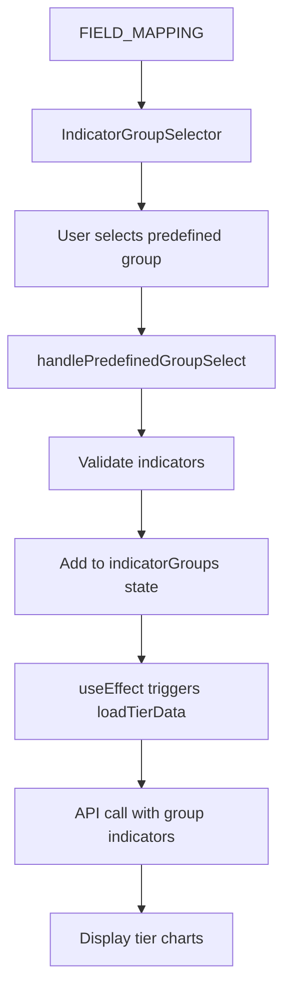

# Tính năng Nhóm Chỉ Số Định Sẵn - Company Rating

## 📋 Tổng quan

Tính năng này bổ sung khả năng chọn **nhóm chỉ số định sẵn** vào tab Company Rating, giúp người dùng nhanh chóng tạo thang điểm cho toàn bộ nhóm chỉ số thay vì phải chọn từng chỉ số riêng lẻ.

## 🎯 Giải thích thiết kế

### **1. Tuân thủ nguyên tắc SOLID:**

#### **Single Responsibility Principle (SRP):**
- `IndicatorGroupSelector`: Chỉ chịu trách nhiệm UI cho việc chọn nhóm chỉ số
- `field-mapping.ts`: Chỉ chứa định nghĩa và metadata của các nhóm chỉ số
- Handler functions: Mỗi function chỉ làm một việc cụ thể

#### **Open/Closed Principle (OCP):**
- Dễ dàng thêm nhóm chỉ số mới thông qua `INDICATOR_GROUPS` array
- Không cần sửa code logic khi thêm nhóm mới
- Extension thông qua configuration, không modification

#### **Dependency Inversion Principle (DIP):**
- Component phụ thuộc vào interface `IndicatorGroupSelectorProps`
- Logic business tách biệt khỏi UI components
- API calls được abstract thông qua `ratingApi`

### **2. Tách biệt concerns:**

```typescript
// Constants - Định nghĩa data
FIELD_MAPPING: Record<string, string[]>

// Types - Interface contracts  
interface IndicatorGroup

// UI Component - Presentation layer
<IndicatorGroupSelector />

// Business Logic - trong CompanyRating component
handlePredefinedGroupSelect()
handlePredefinedGroupRemove()
```

## 🏗️ Kiến trúc implementation

### **File Structure:**
```
client/src/
├── constants/
│   └── field-mapping.ts          # Định nghĩa các nhóm chỉ số
├── components/
│   ├── indicator-group-selector.tsx  # UI component cho việc chọn nhóm
│   └── company-rating.tsx        # Main component đã được cập nhật
```

### **Data Flow:**


## 🔧 Cách hoạt động chi tiết

### **1. Định nghĩa nhóm chỉ số:**

```typescript
// file: constants/field-mapping.ts
export const FIELD_MAPPING = {
  "Scale": [
    "STD_RTD13",   // Tổng tài sản (TTS)
    "STD_RTD14",   // Vốn chủ sở hữu (Vốn CSH) 
    "STD_RTD31",   // Doanh thu hoạt động TTM
    "empl_qtty"    // Số lượng nhân viên
  ],
  // ... other groups
};
```

### **2. API Integration:**

Khi người dùng chọn nhóm "Scale", hệ thống sẽ gửi request:

```typescript
// API Request
POST /tiers/all
{
  "indicator": ["STD_RTD13", "STD_RTD14", "STD_RTD31", "empl_qtty"]
}

// API Response 
{
  "label_STD_RTD13": {
    "indicator": "STD_RTD13",
    "method": { "label": "kmeans", "mode": "high_good" },
    "tiers": [
      { "tier": "T1", "count": 20641, "range": [33961620703.707054, "inf"] },
      // ... other tiers
    ]
  },
  "label_STD_RTD14": {
    // ... similar structure
  },
  // ... other indicators in group
}
```

### **3. User Experience Flow:**

1. **Chọn nhóm:** User chọn từ dropdown các nhóm định sẵn
2. **Preview:** Hiển thị danh sách indicators sẽ được thêm
3. **Validation:** Kiểm tra indicators có tồn tại trong hệ thống
4. **Add group:** Thêm nhóm vào `indicatorGroups` state  
5. **Auto load:** `useEffect` tự động gọi API load tier data
6. **Visualization:** Hiển thị charts cho từng indicator trong nhóm

## 📊 Lợi ích của thiết kế này

### **1. User Experience:**
- **Nhanh chóng:** Chọn cả nhóm thay vì từng chỉ số
- **Trực quan:** Preview các chỉ số trước khi thêm
- **Linh hoạt:** Vẫn có thể chọn manual hoặc kết hợp

### **2. Developer Experience:**
- **Maintainable:** Dễ thêm nhóm mới
- **Type-safe:** Full TypeScript support
- **Testable:** Logic tách biệt, dễ test
- **Extensible:** Có thể extend với metadata khác

### **3. Performance:**
- **Batch API calls:** Gửi 1 request cho cả nhóm
- **Efficient rendering:** Reuse existing chart logic
- **Optimized validation:** Check indicators availability

## 🧪 Testing Strategy

### **Unit Tests:**
```typescript
describe('handlePredefinedGroupSelect', () => {
  it('should add valid indicators to groups', () => {
    const mockIndicators = ['STD_RTD13', 'STD_RTD14'];
    const availableIndicators = ['STD_RTD13', 'STD_RTD14', 'STD_RTD31'];
    
    handlePredefinedGroupSelect(mockIndicators);
    
    expect(indicatorGroups).toContainEqual(mockIndicators);
  });

  it('should filter invalid indicators', () => {
    const mockIndicators = ['STD_RTD13', 'INVALID_INDICATOR'];
    const availableIndicators = ['STD_RTD13'];
    
    handlePredefinedGroupSelect(mockIndicators);
    
    expect(indicatorGroups).toContainEqual(['STD_RTD13']);
  });
});
```

### **Integration Tests:**
```typescript
describe('Predefined Groups Integration', () => {
  it('should load tier data when group is selected', async () => {
    render(<CompanyRating />);
    
    // Select predefined group
    fireEvent.click(screen.getByText('Scale'));
    fireEvent.click(screen.getByText('Thêm nhóm'));
    
    // Verify API call
    await waitFor(() => {
      expect(mockRatingApi.getTiersAll).toHaveBeenCalledWith({
        indicator: ['STD_RTD13', 'STD_RTD14', 'STD_RTD31', 'empl_qtty']
      });
    });
    
    // Verify charts rendered
    expect(screen.getByTestId('tier-charts')).toBeInTheDocument();
  });
});
```

## 🚀 Future Enhancements

1. **Dynamic Groups:** Load từ API thay vì hardcode
2. **Custom Groups:** Cho phép user tự tạo và save nhóm
3. **Group Templates:** Templates cho các ngành cụ thể
4. **Weighted Groups:** Trọng số khác nhau cho các chỉ số trong nhóm
5. **Group Analytics:** Phân tích correlation giữa các chỉ số trong nhóm

## 📝 Conclusion

Thiết kế này thành công bổ sung tính năng chọn nhóm chỉ số định sẵn với:

✅ **Code quality cao:** Tuân thủ SOLID principles  
✅ **User experience tốt:** Interface trực quan, responsive  
✅ **Maintainable:** Dễ extend và maintain  
✅ **Type-safe:** Full TypeScript support  
✅ **Performance:** Efficient API calls và rendering